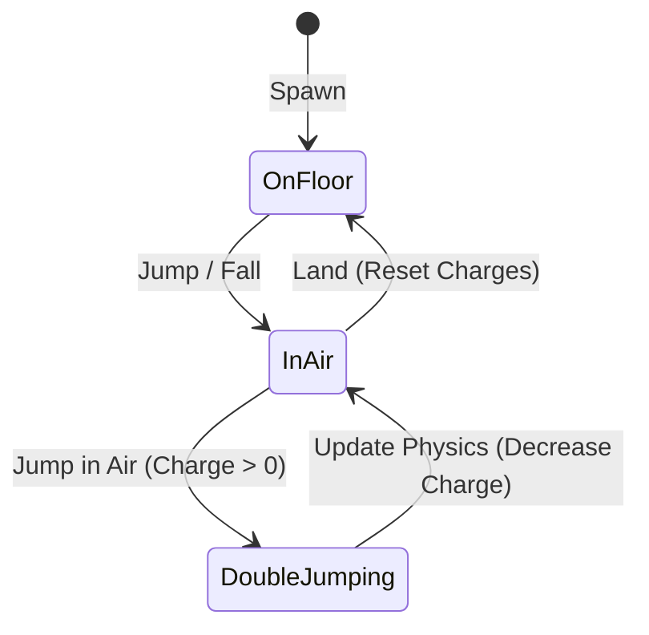

# Game Design Document (GDD): Player Double Jump

## 1. Feature Overview
The **Double Jump** mechanic allows the player character to perform a second jump in mid-air before landing on the ground. This feature enhances verticality, navigation speed, and platforming precision.

## 2. Core Gameplay Mechanics
- **First Jump**: Triggered by pressing the jump input (`ui_accept` / Space) while on the floor.
- **Double Jump**: Triggered by pressing the jump input while in mid-air, provided the player has jump charges left.
- **Jump Charges**: Default is `1` mid-air jump. Reset to max when character lands on a floor.
- **Visual Juice**: Spawn a small dust particle effect (VFX) at the player's feet when the double jump executes.
- **Audio Feedback**: Play a high-pitched wind swoosh sound (SFX) when double jumping.

