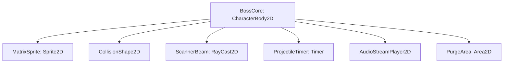

# Technical Architecture Document (TAD): Neon Netrun

## 1. Modular Directory Structure
All gameplay components reside in `Source/Entities/Netrun/`:
```
Source/Entities/Netrun/
├── Boss/
│   ├── boss_core.tscn
│   └── boss_core.gd
├── Minions/
│   ├── minion_base.gd
│   ├── minion_trojan.gd
│   ├── minion_spyware.gd
│   ├── minion_ddos.gd
│   └── logic_bomb.gd
├── Spawners/
│   ├── port_spawner.tscn
│   └── port_spawner.gd
├── VFX/
│   ├── glitch_vfx.tres
│   └── code_explosion_particles.tres
└── SFX/
    ├── sfx_anti_virus_beam.wav
    └── sfx_buffer_overflow.wav
```

---

## 2. Node & Scene Composition

### 2.1 Boss Core (`boss_core.tscn`)
Manages the boss movement, rotation, and weapon systems.

- **FSM States**: 
  - `ACTIVE`: Normal movement and attack patterns.
  - `BUFFER_OVERFLOW` (Stun): Input vector zeroed, weapon timers paused, takes 2x damage.
  - `SYSTEM_PURGE`: Triggers a rapid scale tween on `PurgeArea` (CollisionShape2D) to delete all minion colliders.
  - `DESTROYED`: Triggers code explosion VFX.
- **Rotator Component**: Animates the rotation speed of `MatrixSprite` based on attack states.

### 2.2 Minion Base (`minion_base.gd`)
All minions inherit from a base `CharacterBody2D` configured for pathfinding.
- **Jitter Pathing Formula**:
  ```gdscript
  # Inside physics process
  var target_dir: Vector2 = global_position.direction_to(nav_agent.get_next_path_position())
  var perpendicular_dir: Vector2 = Vector2(-target_dir.y, target_dir.x)
  
  # Apply sine wave jitter to create packet noise movement
  var jitter_offset: float = sin(Time.get_ticks_msec() * jitter_frequency) * jitter_amplitude
  velocity = (target_dir * speed) + (perpendicular_dir * jitter_offset)
  move_and_slide()
  ```
  - *Direct Fiber*: `jitter_amplitude = 0.0`.
  - *VPN Tunneling*: `jitter_amplitude = 120.0`, `jitter_frequency = 0.02`.

### 2.3 Port Spawner (`port_spawner.tscn`)
- **Gateway Focus State**: 
  ```gdscript
  @export var is_focused: bool = false
  @export var focus_spawn_multiplier: float = 2.0
  
  func set_focus(val: bool) -> void:
      is_focused = val
      spawn_timer.wait_time = base_spawn_time / (focus_spawn_multiplier if val else 1.0)
      if val:
          # Emit signal to alert Boss AI core to direct its scanner laser
          NetrunEvents.gateway_focus_alert.emit(global_position)
  ```

---

## 3. Communication & Event Bus (`netrun_events.gd`)
We will use a globally registered Autoload event bus `NetrunEvents` (or `_mcp_game_helper`) to decouple inputs from entities:
```gdscript
# res://addons/godot_ai/runtime/netrun_events.gd
extends Node

signal syscall_triggered(syscall_name: String)
signal gateway_focus_alert(focus_position: Vector2)
signal boss_stunned
signal boss_recovered
```
- **Syscall Handling**: UI buttons emit `syscall_triggered("execute")`. Active minions listen and apply temporary multipliers or trigger early detonation.
