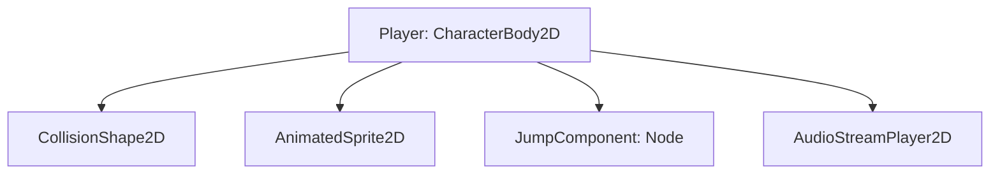

# Technical Architecture Document (TAD): Player Double Jump

## 1. Design & Architectural Patterns
- **Component Pattern**: We decouple player movement and jump capabilities. Instead of adding logic directly into the player script, jump mechanics reside inside a dedicated `JumpComponent` (Node).
- **State Pattern**: The player entity utilizes a Finite State Machine (FSM) to switch between physics states (OnFloor, InAir, DoubleJumping).
- **Observer Pattern**: The `JumpComponent` exposes a signal `double_jumped` which the `Player` node listens to in order to trigger VFX and play SFX.

## 2. Modular File Structure
All files are stored in `Source/Entities/Player/`:
```
Source/Entities/Player/
├── player.tscn
├── player.gd
├── jump_component.gd
├── sfx_double_jump.wav (Placeholder reference)
└── tests/
    └── test_player.gd
```

## 3. Node Hierarchy

