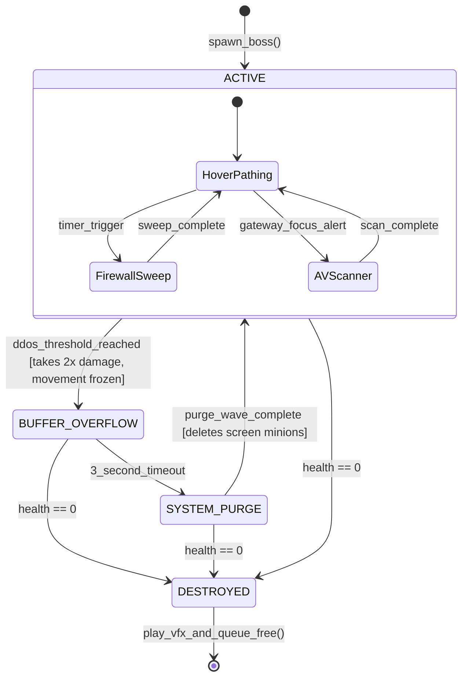
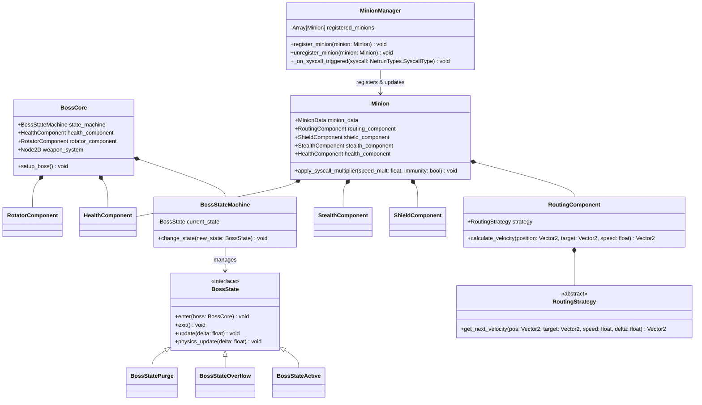

# Architectural Critique & Proposed Architecture: Neon Netrun

This document critiques the current design patterns and Technical Architecture Document (TAD) for **Neon Netrun** against SOLID principles, State Patterns, Component Patterns, and Signal Decoupling. It proposes an updated architecture and a structured implementation plan.

---

## 1. Architectural Critique of Current TAD

### 1.1 SOLID Principles Validation

#### Single Responsibility Principle (SRP)
*   **Current State:** The proposed `boss_core.gd` handles movement pathing, sprite rotation, weapon systems, collision-based damage, shockwave purges, and VFX/SFX trigger logic.
*   **Critique:** This is a major violation of SRP. Combining these behaviors makes the class complex and fragile. Changing the weapon system (e.g. adding new projectile types) shouldn't require modifying movement or stun states.
*   **Resolution:** Extract responsibilities into dedicated component nodes (e.g., `HealthComponent`, `WeaponSystem`, `BossMovementController`, and a distinct FSM).

#### Open/Closed Principle (OCP)
*   **Current State:** Minion pathing behaviors are subclassed (`minion_trojan.gd`, `minion_spyware.gd`, `minion_ddos.gd`), with jitter math hardcoded in the process loop. Spawner focus logic directly edits timers.
*   **Critique:** Adding new minions or routing styles (like proxy bounces) forces us to write new classes or modify base scripts.
*   **Resolution:** Delegate pathing to a `RoutingComponent` that uses a `RoutingStrategy` Resource (Strategy Pattern). New routes can be created by subclassing the resource without altering minion code.

#### Liskov Substitution Principle (LSP)
*   **Current State:** Heavy inheritance is proposed (`minion_base.gd` -> specific minions).
*   **Critique:** Inheritance in GDScript easily violates LSP if subclasses override lifecycle functions (`_ready`, `_physics_process`) and fail to call `super()`, or if they break pathfinding expectations.
*   **Resolution:** Eliminate inheritance in favor of composition. Use a single generic `Minion` scene configured by a `MinionData` Custom Resource, attaching optional components as needed.

#### Interface Segregation Principle (ISP)
*   **Current State:** `minion_base.gd` defines properties like `jitter_amplitude` and `jitter_frequency`.
*   **Critique:** High-speed swarm packets (Port 80 HTTP) don't use jitter pathing, yet they inherit and store these parameters, cluttering their inspector and properties.
*   **Resolution:** Move these properties into a dedicated `JitterRoutingStrategy` resource, which is only used when the routing component is assigned that strategy.

#### Dependency Inversion Principle (DIP)
*   **Current State:** Concrete minions and spawners reference the global autoload event bus `NetrunEvents` directly to listen for syscalls or report gateway focus.
*   **Critique:** High-level entities are directly coupled to a global singleton event bus.
*   **Resolution:** Introduce a `MinionManager` node in the main game loop. It connects to global event buses once and manages syscall effects on its registered minions, keeping minion code completely decoupled.

---

### 1.2 State Machine (FSM) Design
*   **Current State:** The TAD defines FSM states (`ACTIVE`, `BUFFER_OVERFLOW`, `SYSTEM_PURGE`, `DESTROYED`) but leaves the implementation unspecified.
*   **Critique:** Implementing this via `match state:` branches in the physics process is a common anti-pattern that makes adding new states difficult and clutters code.
*   **Resolution:** Implement a node-based State Pattern. `BossCore` will have a `StateMachine` node that manages `BossState` child nodes. Each state class will implement clean `enter`, `exit`, `update`, and `physics_update` lifecycles.

---

### 1.3 Component Pattern Composition
*   **Current State:** The TAD only specifies a "Rotator Component".
*   **Critique:** The architecture misses the opportunity to use decoupled components for crucial systems like health, damage detection, shields, and stealth.
*   **Resolution:** Mandate composition for all entities:
    *   `HealthComponent`: Encapsulates health values and damage logic.
    *   `HitboxComponent` and `HurtboxComponent`: Handle collision interfaces, sending damage events to the health component.
    *   `ShieldComponent`: Provides dynamic barrier logic (activated on HTTPS spawn).
    *   `StealthComponent`: Manages untraceability timers (activated on SSH spawn).

---

### 1.4 Signals & Observer Pattern
*   **Current State:** Every active minion connects to the global `NetrunEvents` autoload to receive syscall triggers (e.g., `syscall_triggered("execute")`).
*   **Critique:** 
    1.  **Performance:** Connecting hundreds of spawned minion instances to a global autoload causes connection overhead.
    2.  **Memory Safety:** If minions are freed without disconnecting, it can lead to memory leak warnings.
    3.  **Type Safety:** Using string parameters (`"execute"`) is fragile and breaks static typing.
*   **Resolution:**
    1.  Use `MinionManager` to orchestrate syscall actions on minions.
    2.  Define syscall types using a strongly typed Enum (`NetrunTypes.SyscallType`) or custom resources.

---

### 1.5 UI and Presentation Separation
*   **Current State:** Unspecified in current TAD, risking tight coupling.
*   **Critique:** Gameplay logic must not refer to UI nodes.
*   **Resolution:** UI view elements (like health bars, cooldown indicators, and focus alerts) must operate on their own CanvasLayer, listening to events emitted by gameplay nodes or the event bus, and must never directly write state back to entities.

---

## 2. Proposed Architectural Structures

### 2.1 Directory Structure
```
Source/Entities/Netrun/
├── Shared/
│   ├── Components/
│   │   ├── health_component.gd
│   │   ├── hitbox_component.gd
│   │   ├── hurtbox_component.gd
│   │   └── rotator_component.gd
│   └── Resources/
│       ├── minion_data.gd
│       ├── routing_strategy.gd
│       ├── strategy_direct.gd
│       └── strategy_jitter.gd
├── Boss/
│   ├── FSM/
│   │   ├── boss_state_machine.gd
│   │   ├── boss_state.gd
│   │   ├── boss_state_active.gd
│   │   ├── boss_state_overflow.gd
│   │   ├── boss_state_purge.gd
│   │   └── boss_state_destroyed.gd
│   ├── boss_core.tscn
│   └── boss_core.gd
├── Minions/
│   ├── Components/
│   │   ├── routing_component.gd
│   │   ├── shield_component.gd
│   │   └── stealth_component.gd
│   ├── minion.tscn
│   ├── minion.gd
│   └── minion_manager.gd
├── Spawners/
│   ├── port_spawner.tscn
│   └── port_spawner.gd
├── Autoloads/
│   ├── netrun_events.gd
│   └── netrun_types.gd
└── UI/
    ├── hud_controller.gd
    └── ...
```

---

### 2.2 Mermaid Diagram: Boss Core State Machine



---

### 2.3 Mermaid Diagram: Node Composition & Relationships



---

### 2.4 Interface/Contract Specifications (Strictly Typed)

#### `netrun_types.gd` (Autoload / Namespace)
```gdscript
# res://Entities/Netrun/Autoloads/netrun_types.gd
class_name NetrunTypes
extends Node

enum SyscallType {
	CHMOD_SPEED_BOOST,  # sudo chmod +x (Trojan speed + firewall immunity)
	PING_DDoS_DETONATE,  # ping -f (DDoS instant detonation -> EMP)
	TRIGGER_PAYLOAD     # logic bomb manual detonation
}

enum PortType {
	PORT_80,   # HTTP
	PORT_443,  # HTTPS
	PORT_22    # SSH
}
```

#### `netrun_events.gd` (Autoload Event Bus)
```gdscript
# res://Entities/Netrun/Autoloads/netrun_events.gd
extends Node

signal syscall_triggered(syscall: NetrunTypes.SyscallType)
signal gateway_focus_alert(focus_position: Vector2)
signal boss_stunned
signal boss_recovered
```

#### `minion_data.gd` (Custom Resource)
```gdscript
# res://Entities/Netrun/Shared/Resources/minion_data.gd
class_name MinionData
extends Resource

@export var name: String = "Minion"
@export var base_speed: float = 150.0
@export var base_health: float = 10.0
@export var ddos_value: float = 1.0 # Contribution to Boss stun
@export var routing_strategy: RoutingStrategy
```

#### `minion.gd` (Statically Typed Component Shell)
```gdscript
# res://Entities/Netrun/Minions/minion.gd
class_name Minion
extends CharacterBody2D

@export var minion_data: MinionData

@onready var routing_component: RoutingComponent = $RoutingComponent
@onready var health_component: HealthComponent = $HealthComponent
@onready var shield_component: ShieldComponent = $ShieldComponent
@onready var stealth_component: StealthComponent = $StealthComponent

var speed_multiplier: float = 1.0
var has_firewall_immunity: bool = false

func _ready() -> void:
	if minion_data:
		health_component.max_health = minion_data.base_health
		health_component.current_health = minion_data.base_health
		routing_component.set_strategy(minion_data.routing_strategy)
	
	# Register with manager
	var manager: MinionManager = get_tree().get_first_node_in_group("minion_managers") as MinionManager
	if manager:
		manager.register_minion(self)

func _physics_process(delta: float) -> void:
	var target_velocity: Vector2 = routing_component.get_velocity(
		global_position, 
		get_target_position(), 
		minion_data.base_speed * speed_multiplier, 
		delta
	)
	velocity = target_velocity
	move_and_slide()

func get_target_position() -> Vector2:
	# Query boss group or path
	var boss: Node2D = get_tree().get_first_node_in_group("boss") as Node2D
	return boss.global_position if boss else global_position

func apply_syscall_effect(syscall: NetrunTypes.SyscallType) -> void:
	match syscall:
		NetrunTypes.SyscallType.CHMOD_SPEED_BOOST:
			speed_multiplier = 2.0
			has_firewall_immunity = true
			await get_tree().create_timer(2.0).timeout
			speed_multiplier = 1.0
			has_firewall_immunity = false
		NetrunTypes.SyscallType.PING_DDoS_DETONATE:
			detonate_payload()

func detonate_payload() -> void:
	# Visual/audio FX & apply DDoS points to boss
	queue_free()
```

---

## 3. Implementation Plan & Phased Roadmap

### Phase 1: Shared Core Components & Event Systems
1.  Create `netrun_types.gd` and `netrun_events.gd` autoload scripts. Register them in project settings.
2.  Implement `HealthComponent`, `HitboxComponent`, and `HurtboxComponent` scripts to handle generic damage propagation.
3.  Write base abstract classes for `RoutingStrategy` and subclass them to create `DirectRoutingStrategy` and `JitterRoutingStrategy`.

### Phase 2: Entity Composition (Minions & Spawners)
1.  Implement `MinionManager` class and place it in the level scene tree under a global group.
2.  Build the generic `Minion` scene composed of:
    *   `RoutingComponent`
    *   `HealthComponent`
    *   `ShieldComponent` and `StealthComponent` (initialized dynamically based on spawn port).
3.  Build `PortSpawner` to instantiate `Minion` scenes, assigning appropriate custom resources (`MinionData`) based on the active port (80, 443, 22).

### Phase 3: Boss Core & FSM Integration
1.  Implement the node-based `BossStateMachine` and create state scripts for `Active`, `Overflow` (stun), and `Purge` states.
2.  Implement weapon behaviors inside the `Active` state (firewall lines, AV scanners, code projectiles).
3.  Link the `BossCore` damage handling to the `HealthComponent`. In `Overflow` state, override the damage calculation to multiply inputs by 2.0.

### Phase 4: UI/Presentation Decoupling
1.  Build the `HUDController` CanvasLayer to display gateway cooldown timers, active port overclock values, and the Boss's buffer status bar.
2.  All HUD animations or status updates must be driven by signals emitted from the Event Bus or direct entity events (e.g., `health_changed`).

### Phase 5: Verification & QA (Unit Tests)
1.  Create a test suite using **GUT (Godot Unit Testing)**.
2.  Verify:
    *   Minions apply jitter trajectory correct math.
    *   Boss FSM transitions correctly on DDoS stun thresholds.
    *   Syscalls update minion properties without memory leaks or missing references.
